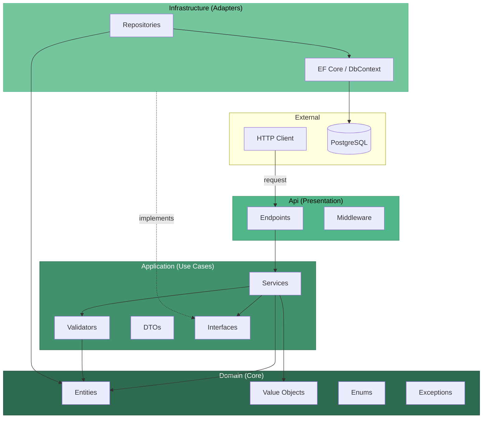

# TreasuryTransfers

API de transferencias entre cuentas de tesorería con soporte multi-moneda, conversión FX e idempotencia.

## Arquitectura

El proyecto sigue una arquitectura en capas (Clean Architecture):



```
src/
├── TreasuryTransfers.Api            → Endpoints, Middleware
├── TreasuryTransfers.Application    → Servicios, DTOs, Validadores, Mappings
├── TreasuryTransfers.Domain         → Entidades, Value Objects, Enums, Excepciones
└── TreasuryTransfers.Infrastructure → Repositorios, Persistencia (EF Core + PostgreSQL)
tests/
└── TreasuryTransfers.Tests          → Tests unitarios (xUnit)
```

Las dependencias fluyen hacia adentro: **Api → Application → Domain ← Infrastructure**. Domain no depende de nada externo.

- **Domain**: Contiene las entidades (`Account`, `LedgerTransaction`), value objects (`Currency` con sus reglas de decimales y redondeo), enums y excepciones de negocio. No tiene dependencias externas.
- **Application**: Orquesta la lógica de negocio. Define interfaces (`IRepository`, `IAccountService`, `ILedgerTransactionRepository`) que Infrastructure implementa. Contiene los validadores, servicios y mappings a DTOs.
- **Infrastructure**: Implementa la persistencia. `AccountsRepository` mantiene las cuentas en memoria (según la consigna). `LedgerTransactionRepository` persiste las transacciones en PostgreSQL vía EF Core.
- **Api**: Capa de entrada. Minimal APIs para los endpoints, middleware de manejo de excepciones que mapea errores de dominio a HTTP status codes.
- **Tests**: Tests unitarios con xUnit. Los repositorios se testean con EF Core InMemory para evitar dependencias externas.

## Requisitos previos

- [Docker](https://www.docker.com/products/docker-desktop/) (para levantar con docker compose)
- [.NET 8 SDK](https://dotnet.microsoft.com/download/dotnet/8.0) (solo si querés correr tests o desarrollar localmente)

## Cómo levantar el proyecto

```bash
docker compose up --build
```

Esto levanta:
- **PostgreSQL 16** en el puerto `5432`
- **API** en el puerto `8080` con migraciones automáticas al iniciar

Swagger UI disponible en: **http://localhost:8080/swagger**

## Cómo correr los tests

```bash
dotnet test tests/TreasuryTransfers.Tests
```

## Cuentas disponibles (en memoria)

| ID          | Moneda | Balance inicial | Estado |
|-------------|--------|-----------------|--------|
| ACC-USD-1   | USD    | 10,000.00       | Active |
| ACC-USD-2   | USD    | 500.00          | Active |
| ACC-ARS-1   | ARS    | 1,000,000.00    | Active |
| ACC-CLP-1   | CLP    | 0               | Active |
| ACC-FROZEN  | USD    | 9,999.00        | Frozen |

## Endpoints

### `POST /transfers`
Crea una nueva transferencia entre cuentas.

### `GET /transfers`
Devuelve todas las transacciones registradas.

### `GET /accounts`
Devuelve todas las cuentas con sus saldos actuales.

## Ejemplos con curl

### Transferencia misma moneda (USD → USD)

```bash
curl -X POST http://localhost:8080/transfers \
  -H "Content-Type: application/json" \
  -d '{
    "operationId": "11111111-1111-1111-1111-111111111111",
    "sourceAccountId": "ACC-USD-1",
    "targetAccountId": "ACC-USD-2",
    "amount": 200,
    "currency": "USD",
    "fx": null
  }'
```

### Transferencia con conversión FX (USD → ARS)

```bash
curl -X POST http://localhost:8080/transfers \
  -H "Content-Type: application/json" \
  -d '{
    "operationId": "22222222-2222-2222-2222-222222222222",
    "sourceAccountId": "ACC-USD-1",
    "targetAccountId": "ACC-ARS-1",
    "amount": 100,
    "currency": "USD",
    "fx": 1000
  }'
```

### Transferencia a CLP (redondeo a 0 decimales)

`33.33 USD × 950 = 31,663.50` → CLP no admite decimales → se redondea a `31,664` (banker's rounding).

```bash
curl -X POST http://localhost:8080/transfers \
  -H "Content-Type: application/json" \
  -d '{
    "operationId": "33333333-3333-3333-3333-333333333333",
    "sourceAccountId": "ACC-USD-1",
    "targetAccountId": "ACC-CLP-1",
    "amount": 33.33,
    "currency": "USD",
    "fx": 950
  }'
```

### Idempotencia (repetir misma operationId)

```bash
curl -X POST http://localhost:8080/transfers \
  -H "Content-Type: application/json" \
  -d '{
    "operationId": "11111111-1111-1111-1111-111111111111",
    "sourceAccountId": "ACC-USD-1",
    "targetAccountId": "ACC-USD-2",
    "amount": 200,
    "currency": "USD",
    "fx": null
  }'
```
> Devuelve `200 OK` con la transacción existente (no duplica el movimiento).

### Transferencia con cuenta frozen (error 400)

```bash
curl -X POST http://localhost:8080/transfers \
  -H "Content-Type: application/json" \
  -d '{
    "operationId": "44444444-4444-4444-4444-444444444444",
    "sourceAccountId": "ACC-FROZEN",
    "targetAccountId": "ACC-USD-1",
    "amount": 100,
    "currency": "USD",
    "fx": null
  }'
```
> Devuelve `400 Bad Request` con `{ "code": "VALIDATION_ERROR", "message": "Account 'ACC-FROZEN' is frozen and cannot be used for transfers." }`.

### Consultar saldos

```bash
curl http://localhost:8080/accounts
```

### Consultar transacciones

```bash
curl http://localhost:8080/transfers
```

## Validaciones

| Regla | HTTP Status |
|-------|-------------|
| Monto ≤ 0 | 400 |
| Moneda no soportada | 400 |
| Cuentas origen y destino iguales | 400 |
| Currency del request no coincide con la cuenta origen | 400 |
| Decimales inválidos para la moneda (ej: CLP no acepta decimales) | 400 |
| Cuenta frozen | 400 |
| Saldo insuficiente | 400 |
| FX enviado con misma moneda / FX faltante con distinta moneda / FX ≤ 0 | 400 |
| Cuenta no encontrada | 404 |

Todas las respuestas de error tienen el formato:
```json
{
  "code": "VALIDATION_ERROR",
  "message": "Descripción del error."
}
```

## Decisiones de diseño

### Redondeo de montos
Se eligió **redondeo** por sobre truncado, usando la política **banker's rounding** (`MidpointRounding.ToEven`).

- **Truncado** descarta decimales siempre hacia abajo, generando pérdida sistemática acumulada en las cuentas destino.
- **Banker's rounding** redondea al par más cercano cuando el valor está exactamente en el punto medio (`.5`), eliminando el sesgo en ambas direcciones. Es el estándar en sistemas financieros.

El redondeo se aplica al monto acreditado (`amount × fx`) según los decimales de la moneda destino antes de actualizar el balance.

Ejemplo: `33.33 USD × 950 (FX) = 31,663.50 → 31,664 CLP` (0 decimales, `.5` redondea al par más cercano).

### Conversión FX
- Si origen y destino tienen la **misma moneda**: el campo `fx` se rechaza si viene. Se optó por rechazarlo en lugar de ignorarlo para brindar mayor claridad al cliente y ser explícito con el error, ya que aceptar un campo que internamente no se usa puede generar confusión.
- Si las monedas **difieren**: `fx` es obligatorio. Convención: `fx` es el precio de 1 unidad de moneda origen en moneda destino. `amountCredited = amount × fx`.

### Idempotencia
`operationId` es la clave de idempotencia. Si ya fue procesada exitosamente, la API devuelve `200 OK` con la transacción existente. La primera vez devuelve `201 Created`.

### Manejo de dinero
Se usa el tipo `decimal` en todo el flujo (entidades, servicios, DTOs) para evitar los problemas clásicos de punto flotante con dinero.

Cada moneda define sus decimales permitidos a través del value object `Currency`:
- **USD**: 2 decimales
- **ARS**: 2 decimales
- **CLP**: 0 decimales (solo enteros)

El monto del request se valida contra los decimales de la moneda origen antes de procesar la operación.